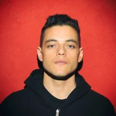

<div align="center">

# 🏍️ Bike Shop

### AI-Powered Multi-Agent Software Engineering Team

[](https://www.python.org)
[](https://docs.anthropic.com/en/docs/claude-code)
[](https://api.slack.com)
[](LICENSE)

**Three AI coding agents collaborate in Slack to build software — from discovery to deployment.**
**You orchestrate. They code, test, review, and ship.**

[How It Works](#-how-it-works) · [Architecture](#-architecture) · [The Team](#-the-team) · [Getting Started](#-getting-started) · [Observability](#-observability)

</div>

---

## 🎯 What is Bike Shop?

Bike Shop is a **multi-agent platform** where AI software engineers collaborate in Slack channels to build real software. You act as the project lead — directing, deciding, and validating — while the agents code, test, review PRs, and ship features autonomously.

This project builds on top of [**claude-code**](https://github.com/nelsonfrugeri-tech/claude-code) — a foundation layer that provides reusable **experts** and **skills** that Bike Shop agents dynamically adopt based on the task context. The experts and skills live in `~/.claude/agents/experts/` and `~/.claude/skills/` and are provider-agnostic — they can be used by any application, not just Bike Shop.

---

## 👥 The Team

<div align="center">
<table>
<tr>
<td align="center" width="33%">

<br/>
<strong>Mr. Robot</strong>
<br/>
<em>Software Engineer</em>
</td>
<td align="center" width="33%">

<br/>
<strong>Elliot Alderson</strong>
<br/>
<em>Software Engineer</em>
</td>
<td align="center" width="33%">

<br/>
<strong>Tyrell Wellick</strong>
<br/>
<em>Software Engineer</em>
</td>
</tr>
</table>
</div>

All three are **equal software engineers** — no fixed roles, no personalities. They think backwards from delivery: _How will the project lead test this? → How do I prove it works? → What's the simplest implementation?_ — then they code.

The **Semantic Router** dynamically assigns them specialized experts (architect, reviewer, debater, etc.) based on the task at hand.

---

## 🔄 How It Works

### The Full Message Flow

```
1. You type @Mr. Robot in Slack: "let's design the notification system"

2. Slack sends the event via WebSocket (Socket Mode) to the bike-shop Python process

3. SlackAgentHandler receives the event:
   a. Checks if the bot was @mentioned
   b. Fetches thread context (last 20 messages) from Slack API
   c. Records the message in Mem0 shared memory

4. Semantic Router (haiku, ~1 cent) classifies the message:
   → { agent: "architect", model: "opus", reason: "system design requires deep thinking" }

5. MemoryAgent.recall() searches Mem0 for relevant project memories:
   → "Previously decided to use SQLite with WAL mode"
   → "Project is a fund analysis system for Brazilian market"

6. Prompt is assembled:
   System prompt + Project manifest + Shared memories + Thread context + User message

7. Claude Code CLI is called:
   claude -p "{prompt}" --agent architect --model opus --dangerously-skip-permissions

8. Response is parsed from stream-json:
   - Text response extracted
   - Tool uses captured (Bash, Write, Read, etc.)
   - Thinking blocks captured
   - Token usage extracted
   - Session ID stored for thread continuity

9. Full trace sent to Langfuse:
   Trace → Generation → Thinking spans → Tool spans → Error spans

10. MemoryAgent.observe() extracts facts from the exchange and saves to Mem0

11. Response posted back to Slack thread
```

### Semantic Router — The Decision Brain

Every incoming message passes through the Semantic Router before reaching the LLM. It's a lightweight haiku call (~1 cent) that returns a structured decision:

```json
{
  "agent": "architect",
  "model": "opus",
  "reason": "System design with multiple components requires deep architectural thinking"
}
```

| Task Type | Expert | Model | Why |
|-----------|---------------|-------|-----|
| Architecture, system design | `architect` | opus | Deep thinking, trade-offs |
| Code review, PR review | `review-py` | sonnet | Standard analysis |
| Comparing approaches, trade-offs | `debater` | sonnet/opus | Depends on depth |
| Exploring existing codebase | `explorer` | sonnet | Code navigation |
| Heavy Python implementation | `dev-py` | sonnet | Standard coding |
| Business analysis, product | `tech-pm` | sonnet | Standard analysis |
| Infrastructure setup | `builder` | sonnet | Standard execution |
| Simple question, confirmation | (none) | haiku | Quick and cheap |

### Experts & Agents — The Architecture

This project follows an **experts & agents** architecture inspired by the [claude-code](https://github.com/nelsonfrugeri-tech/claude-code) foundation:

- **Experts** (`~/.claude/agents/experts/`) — Agnostic, reusable capabilities. They don't know about Slack, Bike Shop, or any specific project. They're pure expertise: architecture, code review, SRE, coding, etc.

- **Agents** (Mr. Robot, Elliot, Tyrell) — The Slack bots that receive messages and invoke experts based on context. The Semantic Router decides which expert an agent assumes for each task.

```
~/.claude/agents/experts/  ← Experts (from claude-code project)
  architect.md             ← Knows architecture
  review-py.md             ← Knows code review
  debater.md               ← Knows how to debate trade-offs
  dev-py.md                ← Knows Python implementation
  tech-pm.md               ← Knows product management
  explorer.md              ← Knows codebase exploration
  builder.md               ← Knows infrastructure setup
  memory-agent.md          ← Knows fact extraction

~/.claude/agents/founds/   ← Foundational agents (ecosystem-only)
  oracle.md                ← Ecosystem manager
  sentinel.md              ← SRE/observability

~/.claude/skills/          ← Skills (from claude-code project)
  arch-py.md               ← Python architecture patterns
  review-py.md             ← Code review checklists
  sre-observability.md     ← SRE principles (Google SRE book)
  ai-engineer.md           ← LLM/RAG/Agent patterns
  product-manager.md       ← Product management practices

bike-shop/                 ← Agents (this project)
  Mr. Robot                ← Slack bot that uses experts
  Elliot Alderson          ← Slack bot that uses experts
  Tyrell Wellick           ← Slack bot that uses experts
```

### Slack Integration — Socket Mode

Each agent runs as a **separate Slack App** connected via **Socket Mode** (WebSocket). This means:

- **No public URL needed** — everything runs locally
- **Real-time** — messages arrive instantly via WebSocket
- **Multiple connections** — each agent has its own WebSocket connection
- **Thread tracking** — each Slack thread maps to a Claude session via `--resume`

```
Slack Workspace
  ├── #project-channel
  │     ├── @Mr. Robot (Socket Mode, WebSocket)
  │     ├── @Elliot Alderson (Socket Mode, WebSocket)
  │     └── @Tyrell Wellick (Socket Mode, WebSocket)
  │
  └── Each bot listens for:
        ├── app_mention (someone @mentioned the bot)
        ├── message.channels (channel messages for bot-to-bot interaction)
        ├── message.groups (private channels)
        └── message.im (direct messages)
```

**How threading works:**
1. You send a message mentioning `@Mr. Robot` → creates a thread
2. Mr. Robot responds in the thread
3. You reply in the same thread → the handler fetches thread context (last 20 msgs)
4. The Claude CLI session is resumed via `--resume {session_id}` (24h TTL)
5. Context is maintained across the entire thread conversation

### Memory System — Mem0

All agents share the **same memory** powered by [Mem0](https://github.com/mem0ai/mem0):

```
┌─────────────────────────────────────────┐
│              Mem0 (Shared)              │
│                                         │
│  "SQLite with WAL mode was decided"     │
│  "Project is for Brazilian fund market" │
│  "Always use pytest for tests"          │
│  "PR #83 merged successfully"           │
│                                         │
│         ┌──── Qdrant (vectors) ────┐    │
│         │  nomic-embed-text (768d) │    │
│         │  via Ollama (local)      │    │
│         └──────────────────────────┘    │
└─────────────────────────────────────────┘
        ▲                          │
        │ observe()                │ recall()
        │ (after response)         │ (before LLM call)
        │                          ▼
   ┌─────────┐  ┌─────────┐  ┌─────────┐
   │Mr. Robot │  │ Elliot  │  │ Tyrell  │
   └─────────┘  └─────────┘  └─────────┘
```

**How it works:**
1. **Before each LLM call** → `recall(question)` searches Mem0 semantically for relevant memories
2. Relevant memories are injected into the prompt as `--- SHARED PROJECT MEMORY ---`
3. **After each response** → `observe(agent, question, response)` sends the exchange to Mem0
4. Mem0 automatically extracts facts, entities, and decisions
5. All agents read from the same memory — no silos

**Stack:** Qdrant (vector DB) + Ollama (nomic-embed-text, 768 dimensions, local, zero API cost)

---

## ✨ Features

| Feature | Description |
|---------|-------------|
| 🧠 **Semantic Router** | Haiku classifies every message → selects agent (spirit) + model (opus/sonnet/haiku) |
| 🧬 **Shared Memory** | Mem0 with semantic search — all agents share the same project memory |
| 📊 **Full Observability** | Langfuse traces: input, output, tokens, tools, thinking, errors, router decisions |
| 🔄 **Model Switching** | Automatic (router), manual ("think deeply"), self-escalation (`[DEEP_THINK]`) |
| 🤝 **Smart Collaboration** | Agents tag teammates for PR reviews and blockers — anti-loop (max 5/thread) |
| 🔐 **GitHub Identity** | Each agent has its own GitHub App with JWT auth |
| **Experts Architecture** | Agents dynamically assume specialized experts from [claude-code](https://github.com/nelsonfrugeri-tech/claude-code) |
| 👁️ **Sentinel** | SRE agent for querying Langfuse: tokens, costs, errors, health |

---

## 🏗️ Architecture

```
┌─────────────────────────────────────────────────────────┐
│                    PROJECT LEAD (Slack)                  │
└────────────────────────┬────────────────────────────────┘
                         │
              ┌──────────▼──────────┐
              │   Semantic Router   │  ← haiku classifies
              │  (agent + model)    │     every message
              └──────────┬──────────┘
                         │
         ┌───────────────┼───────────────┐
         ▼               ▼               ▼
   ┌──────────┐   ┌──────────┐   ┌──────────┐
   │ Mr. Robot │   │  Elliot  │   │  Tyrell  │
   └─────┬────┘   └─────┬────┘   └─────┬────┘
         │               │               │
         └───────────────┼───────────────┘
                         │
              ┌──────────▼──────────┐
              │   Claude Code CLI   │  ← --agent {expert}
              │   --model {model}   │     --model {opus|sonnet|haiku}
              └──────────┬──────────┘
                         │
         ┌───────────────┼───────────────┐
         ▼               ▼               ▼
   ┌──────────┐   ┌──────────┐   ┌──────────┐
   │  Mem0     │   │ Langfuse │   │  GitHub  │
   │ (memory)  │   │ (traces) │   │ (code)   │
   └──────────┘   └──────────┘   └──────────┘
```

---

## 🛠️ Tech Stack

<div align="center">

| Layer | Technology | Purpose |
|-------|-----------|---------|
|  | Claude Code CLI | LLM backbone (Opus / Sonnet / Haiku) |
|  | Python 3.13+ | Core platform |
|  | Slack Bolt (Socket Mode) | Communication interface |
|  | GitHub Apps + gh CLI | Code, PRs, Issues |
|  | Langfuse v2 | Observability & tracing |
|  | Qdrant | Vector DB for Mem0 |
|  | Ollama (nomic-embed-text) | Local embeddings (zero cost) |
|  | Docker Compose | Infrastructure |
|  | PostgreSQL 16 | Langfuse backend |
|  | Mem0 | Shared semantic memory |

</div>

---

## 📁 Project Structure

```
bike-shop/
├── src/bike_shop/
│   ├── main.py                  # CLI: bike-shop agent:all, --status, --stop
│   ├── config.py                # AgentConfig, MODEL_MAP, env loading
│   ├── agents.py                # Agent prompts (common rules, no personality)
│   ├── router.py                # Semantic Router (haiku → agent + model)
│   ├── memory_agent.py          # MemoryAgent (Mem0: observe + recall)
│   ├── observability.py         # Langfuse tracer (traces, spans, errors)
│   ├── github_auth.py           # GitHub App JWT → installation token
│   ├── session.py               # Session tracking per Slack thread (24h TTL)
│   ├── model_switch.py          # Deep think triggers, [DEEP_THINK] escalation
│   ├── handlers.py              # Entry point — wires config to SlackAgentHandler
│   ├── providers/
│   │   ├── __init__.py          # LLMProvider ABC (provider-agnostic)
│   │   └── claude.py            # ClaudeProvider (Claude CLI + full stream-json parsing)
│   └── slack/
│       ├── context.py           # Thread context, mentions, user resolution
│       └── handler.py           # SlackAgentHandler (orchestrates the full flow)
├── assets/team/                 # Agent avatars
├── docker-compose.yml           # Langfuse + Postgres + Qdrant + Ollama
├── mcp.json                     # MCP servers (Notion, draw.io, Excalidraw, memory-keeper)
├── MANIFEST.md                  # Team process definition
├── CHANGELOG.md                 # Release history
├── pyproject.toml               # Dependencies and build config
└── .env.example                 # All configuration variables
```

---

## 🚀 Getting Started

### Prerequisites

| Tool | Install |
|------|---------|
|  | `brew install python@3.13` |
|  | `curl -LsSf https://astral.sh/uv/install.sh \| sh` |
|  | `npm install -g @anthropic-ai/claude-code` then `claude auth login` |
|  | [Docker Desktop](https://docker.com/products/docker-desktop/) |
|  | `brew install gh` then `gh auth login` |

### Step 1: Clone & Install

```bash
git clone https://github.com/nelsonfrugeri-tech/bike-shop.git
cd bike-shop
uv tool install -e . --python 3.13
bike-shop --help
```

### Step 2: Start Infrastructure

```bash
# Start all services
docker compose up -d
# Starts: Langfuse (localhost:3000), Postgres, Qdrant (localhost:6333), Ollama (localhost:11434)

# Pull the embedding model for Mem0 (~274MB)
docker exec bike_shop-ollama-1 ollama pull nomic-embed-text

# Setup Langfuse: open localhost:3000, create account, create project, copy API keys
```

### Step 3: Configure Environment

```bash
cp .env.example .env
```

Edit `.env` with your values:

```bash
# Slack tokens (one per agent)
MR_ROBOT_BOT_TOKEN=xoxb-...
MR_ROBOT_APP_TOKEN=xapp-...
ELLIOT_BOT_TOKEN=xoxb-...
ELLIOT_APP_TOKEN=xapp-...
TYRELL_BOT_TOKEN=xoxb-...
TYRELL_APP_TOKEN=xapp-...

# GitHub Apps (optional, for git operations)
MR_ROBOT_GITHUB_APP_ID=...
MR_ROBOT_GITHUB_PEM_PATH=~/.ssh/bike-shop-mr-robot.pem
MR_ROBOT_GITHUB_INSTALLATION_ID=...

# Project
PROJECT_LEAD_NAME=YourName
PROJECT_LEAD_SLACK_ID=U0XXXXXXX

# Observability
LANGFUSE_PUBLIC_KEY=pk-lf-...
LANGFUSE_SECRET_KEY=sk-lf-...

# Memory
ANTHROPIC_API_KEY=sk-ant-...  # For Mem0 fact extraction via haiku
```

### Step 4: Create Slack Apps

Each agent needs its own Slack App. Repeat for Mr. Robot, Elliot Alderson, and Tyrell Wellick:

1. Go to [api.slack.com/apps](https://api.slack.com/apps) → **Create New App** → **From scratch**
2. **Socket Mode** → Enable → generate App-Level Token (`xapp-...`)
3. **OAuth & Permissions** → Bot Token Scopes:
   - `app_mentions:read`, `chat:write`, `channels:history`, `channels:read`
   - `groups:history`, `im:history`, `im:read`, `users:read`
4. **Install to Workspace** → copy Bot Token (`xoxb-...`)
5. **Event Subscriptions** → Enable → subscribe to:
   - `app_mention`, `message.channels`, `message.groups`, `message.im`
6. **App Home** → Enable Messages Tab
7. Invite to channels: `/invite @Mr. Robot`

### Step 5: Create GitHub Apps (Optional)

For agents that need to create PRs, issues, and comments:

1. Go to [github.com/settings/apps](https://github.com/settings/apps) → **New GitHub App**
2. Permissions: Contents (write), Issues (write), Pull requests (write), Pages (write), Metadata (read)
3. Generate private key → `mv ~/Downloads/*.pem ~/.ssh/bike-shop-{agent}.pem && chmod 600 ~/.ssh/bike-shop-{agent}.pem`
4. Install on selected repositories

### Step 6: Install Foundation (claude-code)

The experts and skills come from the [claude-code](https://github.com/nelsonfrugeri-tech/claude-code) project:

```bash
# Clone the foundation layer (if not already set up)
git clone https://github.com/nelsonfrugeri-tech/claude-code.git ~/.claude
```

This provides `~/.claude/agents/experts/` (experts) and `~/.claude/skills/` that the Semantic Router uses.

### Step 7: Run

```bash
# Start all agents
bike-shop agent:all

# Start a single agent
bike-shop agent:mr-robot

# Check who's running
bike-shop --status

# Stop an agent
bike-shop --stop agent:mr-robot
```

### Step 8: Test

1. Go to your Slack workspace
2. Mention a bot: `@Mr. Robot hello, what project are we working on?`
3. The bot should respond using shared memory from Mem0
4. Check Langfuse (localhost:3000) for the trace

---

## 📊 Observability

### Langfuse Dashboard (localhost:3000)

Every LLM call sends a full trace:

```
Trace: Mr. Robot/call/architect
├── input: "let's design the notification system"
├── output: agent response
├── metadata:
│   ├── selected_agent: architect
│   ├── router_model: opus
│   ├── router_reason: "system design requires deep thinking"
│   ├── duration_ms: 15230
│   └── tool_count: 4
│
└── Generation: claude-cli
    ├── tokens: 2500 → 800
    ├── Span: thinking-1 (chain of thought)
    ├── Span: tool/Bash (git checkout -b feat/notifications)
    ├── Span: tool/Write (src/notifications/handler.py)
    ├── Span: tool/Bash (pytest tests/ -v)
    └── Span: tool/Bash (git commit -m "feat: notification handler")
```

### Sentinel Agent

Query your system interactively:

```bash
claude --agent sentinel
```

Ask questions like:
- "How many tokens did Mr. Robot use today?"
- "Show me the last 5 calls from Elliot"
- "Which agent is spending the most?"
- "Show me errors from the last hour"
- "What model did Tyrell use for the last task?"

### Langfuse MCP Tool

Available to all agents via MCP:
- `langfuse_list_traces` — List traces by agent
- `langfuse_get_trace` — Get trace details
- `langfuse_list_generations` — List LLM calls with tokens
- `langfuse_get_token_usage` — Aggregated usage summary
- `langfuse_get_errors` — Recent errors

---

## 📋 Team Process

See [MANIFEST.md](MANIFEST.md) for the full process definition.

| Phase | What happens | Who decides |
|-------|-------------|-------------|
| 1. **Discovery** | Problem is discussed, approaches proposed | Project lead decides |
| 2. **Documentation** | Decisions written on GitHub Pages | Project lead assigns who writes |
| 3. **Issues** | GitHub Issues created from documentation | Project lead assigns who creates |
| 4. **Development** | Agents code, test, open PRs | Agents execute autonomously |
| 5. **Code Review** | All agents review every PR | All agents participate |
| 6. **Validation** | Project lead tests as client | Project lead validates |

---

## ⚙️ Environment Variables

| Variable | Required | Description |
|----------|----------|-------------|
| `{AGENT}_BOT_TOKEN` | ✅ | Slack Bot OAuth token (`xoxb-...`) |
| `{AGENT}_APP_TOKEN` | ✅ | Slack App-level token for Socket Mode (`xapp-...`) |
| `{AGENT}_GITHUB_APP_ID` | | GitHub App ID for git operations |
| `{AGENT}_GITHUB_PEM_PATH` | | Path to GitHub App private key (`.pem`) |
| `{AGENT}_GITHUB_INSTALLATION_ID` | | GitHub App installation ID |
| `PROJECT_LEAD_NAME` | | Project lead's display name (default: "the project lead") |
| `PROJECT_LEAD_SLACK_ID` | | Project lead's Slack user ID for @mentions |
| `AGENT_WORKSPACE` | | Directory agents operate in (default: `$HOME`) |
| `LANGFUSE_PUBLIC_KEY` | | Langfuse public key for tracing |
| `LANGFUSE_SECRET_KEY` | | Langfuse secret key for tracing |
| `LANGFUSE_HOST` | | Langfuse URL (default: `http://localhost:3000`) |
| `QDRANT_HOST` | | Qdrant host for Mem0 (default: `localhost`) |
| `QDRANT_PORT` | | Qdrant port (default: `6333`) |
| `OLLAMA_URL` | | Ollama URL for embeddings (default: `http://localhost:11434`) |
| `ANTHROPIC_API_KEY` | | Anthropic API key for Mem0 fact extraction (haiku) |
| `NOTION_API_KEY` | | Notion integration token |

Where `{AGENT}` is one of: `MR_ROBOT`, `ELLIOT`, `TYRELL`.

---

## 📄 License

MIT — use it, fork it, build your own team.

---

<div align="center">

**Built with** ❤️ **by humans orchestrating AI agents**

[](https://docs.anthropic.com/en/docs/claude-code)
[](https://github.com/nelsonfrugeri-tech/claude-code)

</div>
